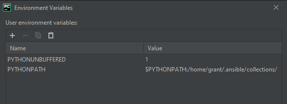

# How to Perform Debugging

The below instructions are written for Linux but include a method for using a remote debugger on Windows. Unless otherwise specified, the instructions are meant to be executed on a Linux machine.

1. Clone the code to a directory of your choosing with your favorite git client or `git clone https://github.com/dell/dellemc-openmanage-ansible-modules.git`
2. Download the code separately with `ansible-galaxy collection install dellemc.openmanage`. On Ubuntu this defaults to `/home/<YOUR_NAME>/.ansible/collections/ansible_collections/dellemc/openmanage/` The problem with this is that this location is not in PYTHONPATH which will cause problems with the debugger.
3. To resolve the pathing issues move the openmanage collection to align with the rest of Dell's code which is in PYTHONPATH with `sudo mv /home/<YOUR_NAME>/.ansible/collections/ansible_collections/dellemc/openmanage/ /usr/local/lib/python3.X/dist-packages/ansible_collections/dellemc/`. The path may be different on your system, but it should be placed with your other packages. Alternatively, you can add the directory `/home/<YOUR_NAME>/.ansible/collections/ansible_collections/dellemc/openmanage/` to PYTHONPATH with `export PYTHONPATH=$PYTHONPATH:/home/<YOUR_NAME>/.ansible/collections`. How to do this on Windows with a remote debugger is shown below.
    1. The location may be different for but the key is `openmanage` must be accessible within the `ansible_collections.dellemc` namespace. That is to say, the path should look like `<SOME_PREFIX (usually dist-packages)>/ansible_collections/dellemc/openmanage`
    2. When we tested, `from ansible.module_utils.six.moves.urllib.error import URLError, HTTPError` still reported an error. This error can be ignored safely. Ansible is doing some import magic to make this work that confuses the IDE's ability to check for the import correctly but it does run.
    3. One thing that isn't immediately obvious about debugging Ansible modules is how to inject arguments. This is described [in the Ansible docs](https://docs.ansible.com/ansible/latest/dev_guide/developing_modules_general.html#exercising-module-code-locally).
    4. If it worked, imports like `from ansible_collections.dellemc.openmanage.plugins.module_utils.dellemc_idrac import iDRACConnection` should import cleanly and without error. Some IDEs may require a restart in order to rescan the available packages.
4. Create a file with any name. We will use `args.json`. Fill it with the arguments you wish to provide to the module:

        {
            "ANSIBLE_MODULE_ARGS": {
                "idrac_ip": "192.168.1.63",
                "idrac_user": "root",
                "idrac_password": "password",
                "share_name": "some_share",
                "share_user": "some_username",
                "share_password": "some_password"
            }
        }

5. Install ansible with `pip install ansible`
6. Execute by running `python -m ansible.modules.some_module /tmp/args.json`. How to run this in an IDE is described below.

## PyCharm

### Windows Only

1. Running PyCharm on Windows: The biggest problem with this is that the Ansible Python package does not install cleanly on Windows. The easiest way to fix this is to run a Linux VM and then use a remote debugger. I installed Ubuntu but any version of Linux will work.
2. Download a copy of [the code](https://github.com/dell/dellemc-openmanage-ansible-modules) and open the folder with PyCharm.
3. Go to File->Settings->Project:<name_of_your_project>->Python Interpreter
4. Click the gear and then click add
5. Use `SSH Interpreter` and then add the Ubuntu box mentioned above or another remote target of your choosing. If you are already on Linux you can use a `Virtualenv environment` or `System Interpreter`

### All Systems

1. You will need to configure the IDE to use the `args.json` file you created above. In PyCharm do this by going to Run-Edit Configurations. In `Parameters` add `<ABSOLUTE_PATH>\args.json`. For example: `C:\Users\grant\Documents\dellemc-openmanage-ansible-modules\args.json`. This will pass the JSON file as an argument to the module when it runs. You should now be able to debug the module directly.
2. It is also possible to pass the arguments within the Python script itself by updating the `main` function with:

        basic._ANSIBLE_ARGS = to_bytes(json.dumps({'ANSIBLE_MODULE_ARGS': {"hostname": "100.100.29.247", "username": "admin", "password": "Dell_123"}}))
        set_module_args(args)
3. If you would like to set PYTHONPATH with PyCharm you can do that by going to Run->Edit Configurations->Environment Variables

